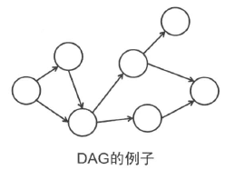
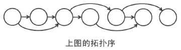

# DAG 的拓扑排序算法（Topological Sort）

> 没有圈的有向图叫做DAG (Directed Acyclic Graph)。在DAG中我们可以给顶点标记一个先后顺序。对于每个顶点我们给它一个编号，第 i 号顶点叫做 $v_i$ 。那么存在从顶点 $v_i$ 到顶点 $v_j$ 的边的时候就有 $i < j$ 成立，这样的编号方式叫做**拓扑序**。





> 如果把图中的顶点按照拓扑序从左到右排列，那么所有的边都是从左指向右的。因此，通过这样的编号方式，有些DAG问题就可以试用DP来解决了，求解拓扑序的算法叫做拓扑排序。

常见的拓扑排序算法有：**Kahn's algorithm** 和 **Depth-first search**。

## Kahn's algorithm

```
L: 包含已排序元素的列表，初始为空
S: 入度为0的节点的集合
while (S不为空集时) {
    从S中移出一个节点n
    将n加入L尾部
    for each (node m with an edge e from n -> m) {
        将边e从图中移除,将m的入度减1
        if (m的入度变为0) {
            将m加入S中
        }
    }
}
if (图中还有节点) {
    return error (图中至少有一个圈)
} else {
    return L (L为图的拓扑排序)
}
```

**复杂度分析：**

- 时间复杂度 $O(N+M)$ ：遍历一个图需要访问所有节点和所有临边，N 和 M 分别为节点数量和临边数量；
- 空间复杂度 $O(N + M)$ ：为建立邻接表所需额外空间。

## Depth-first search

```
L: 包含已排序元素的列表，初始为空
while (当存在没有永久标记的结点时) {
    选出一个未标记的点n
    visit(n)
}
function visit(node n) {
    if (n有永久标记) return
    if (n有临时标记) stop (说明图不是一个DAG)
    给n添加临时标记
    for each (node m with an edge from n -> m) {
        visit(m)
    }
    将n的临时标记去除
    给n添加永久标记
    将n加入L的头部
}
```

**复杂度分析：**

- 时间复杂度 $O(N+M)$ ：遍历一个图需要访问所有节点和所有临边，N 和 M 分别为节点数量和临边数量；
- 空间复杂度 $O(N + M)$ ：为建立邻接表所需额外空间。

