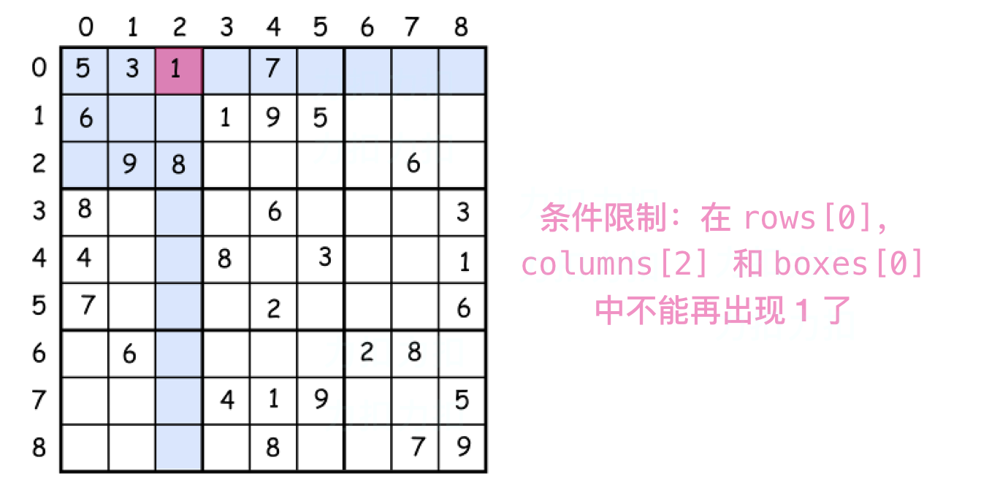
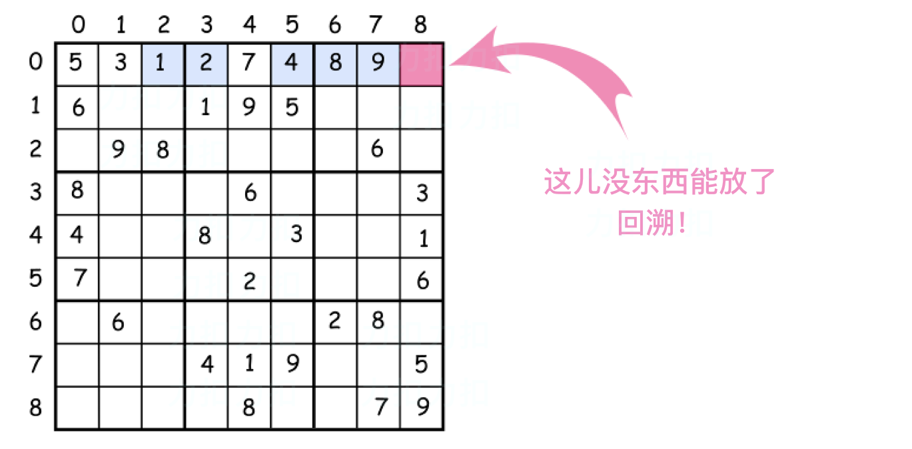

# 解数独

## 方法0：蛮力发

通过蛮力法来生成所有可能用 `1` 到 `9` 填充空白格的解，并且检查合法从而保存解。这意味着共有 $9^{81}$ 个操作需要进行。其中 $9$ 时可行的数字个数，$81$ 时需要填充的格子数目。因此我们必须考虑进一步优化。

## 方法1：回溯法

> 使用两个概念：
>
> 1. 约束编程：在防止每个数字时都设置约数。在数独上防止一个数字后立即排除当前 **行**、**列** 和 **子方块** 对该数字的使用。这回传播 **约束条件** 并有利于减少需要考虑组合的个数。



> 2. 回溯：让我们想象一下已经成功放置了一个数字在数独上。但是该组合不是最优的并且不能继续放置数字了。该怎么办？回溯。意思是回退，来改变之前防止的数字并且继续尝试。如果还是不行，再次 **回溯**。



**如何枚举子方块**

> 一种枚举子方块的提示是：
>
> 使用 `方块索引 = (行 / 3) * 3 + 列 / 3`
>
> 其中 `/` 表示整数除法。


**算法**

现在准备好写回溯函数了

`backtrack(row = 0, col = 0)`。

- 从最左上角的放个开始 `row = 0, col = 0`。直到到达一个空方格。

- 从 `1` 到 `9` 迭代循环数组，舱室放置数字 `d` 进入 `(row, col)` 的格子。

  - 如果数字 `d` 还没有出现在当前行，列和子方块中：

    - 将 `d` 放入 `(row, col)` 格子中。

    - 记录下个 `d` 已经出现在当前行，列和子方块中。

    - 如果这是最后一个格子 `row == 8, col == 8` ：

      - 这意味着已经找出了数独的解。

    - 否则

      - 放置接下来的数字。

        

    - 如果数独的解还没找到：

      将最后的数从 `(row, col)` 移除。

```java
class Solution {
    int n = 3; // box size
    int N = n * n; // row size
    int[][] rows = new int[N][N + 1];
    int[][] columns = new int[N][N + 1];
    int[][] boxes = new int[N][N + 1];
    char[][] board;
    boolean sudokuSolved = false;
    
    public boolean couldPlace(int d, int row, int col) {
        // Check if one could place a number d in (row, col) cell
        int idx = (row / n) * n + col / n;
        return rows[row][d] + columns[col][d] + boxes[idx][d] == 0;
    }
    
    public void placeNumber(int d, int row, int col) {
        // Place a number d in (row, col) cell
        int idx = (row / n) * n + col / n;
        row[row][d]++;
        columns[col][d]++;
        boxes[idx][d]++;
        board[row][col] = (char)(d + '0');
    }
    
    public void removeNumber(int d, int row, int col) {
        // Remove a number which didn't lead to a sulution
        int idx = (row / n) * n + col / n;
        row[row][d]--;
        columns[col][d]--;
        boxes[idx][d]--;
        board[row][col] = '.';
    }
    
    public void placeNextNumbers(int row, int col) {
        // Call backtrack function in recursion to continue 
        // to place numbers till the moment we have a sulution
        // if we're in the last cell
        // that means we have the solution
        if ((col == N - 1) && (row == N - 1)) {
            sudokuSolved = true;
        } else {
            if (col == N - 1) backtrack(row + 1, 0);
            else backtrack(row, col + 1);
        }
    }
    
    public void backtrack(int row, int col) {
        // if the cell is empty
        if (board[row][col] == '.') {
            for (int d = 1; d < 10; d++) {
                if (couldPlace(d, row, col)) {
                    placeNumber(d, row, col);
                    placeNextNumbers(row, col);
                    if (!sudukuSolved) removeNumber(d, row, col);
                }
            }
        } else placeNextNumbers(row, col);
    }
    
    public void solveSudoku(char[][] board) {
        this.board = board;
        
        // init row, columns and boxes
        for (int i = 0; i < N; i++) {
            for(int j = 0; j < N; j++) {
                char num = board[i][j];
                if (num != '.') {
                    int d = Character.getNumericValue(num);
                    placeNumber(d, i, j);
                }
            }
        }
        backtrack(0, 0);
    }
}
```

**复杂性分析**

- 这里的时间复杂性是常数由于数独的大小是固定的，因此没有 N 变量来衡量。

  但是我们可以计算需要操作的次数：$(9!)^9$ 。

  我们考虑第一行，即不多于$9$个格子需要填。

  第一个格子的数字不会多余$9$种情况，

  两个格子不会多于 $9 \times 8$ 种情况，

  三个格子不回多于 $9 \times 8 \times 7$ 种情况等等。

  总之一行可能的情况不会多于 $9!$ 种可能，

  所有行不会多于 $(9!)^9$ 种情况。比较一下：

  - $9^{81}$ = 196627050475552913618075908526912116283103450944214766927315415537966391196809 为蛮力法，
  -  而 $(9!)^9$ = 109110688415571316480344899355894085582848000000000 为回溯法，即数字的操作次数减少了 $10^{27}$ 倍！

- 空间复杂性：数独大小固定，空间用来存储数独，行，列和子方块的结构，每个有 `81` 个元素。